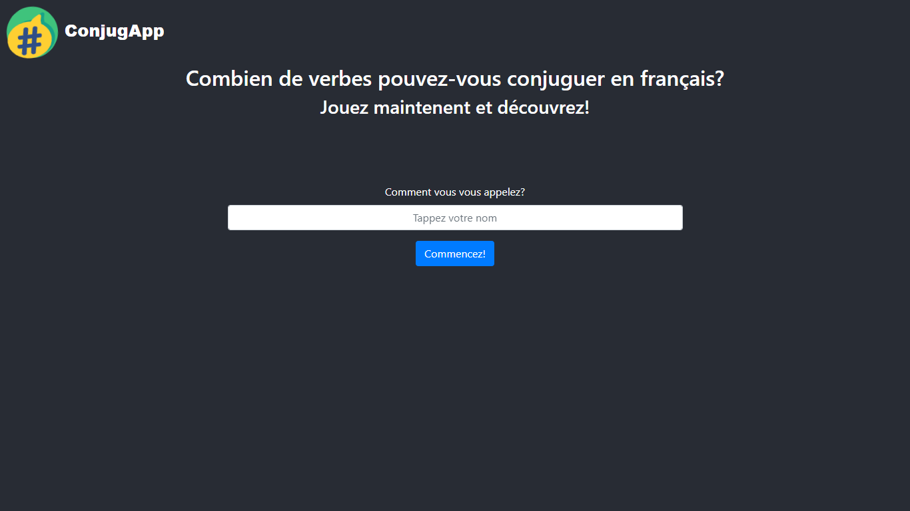
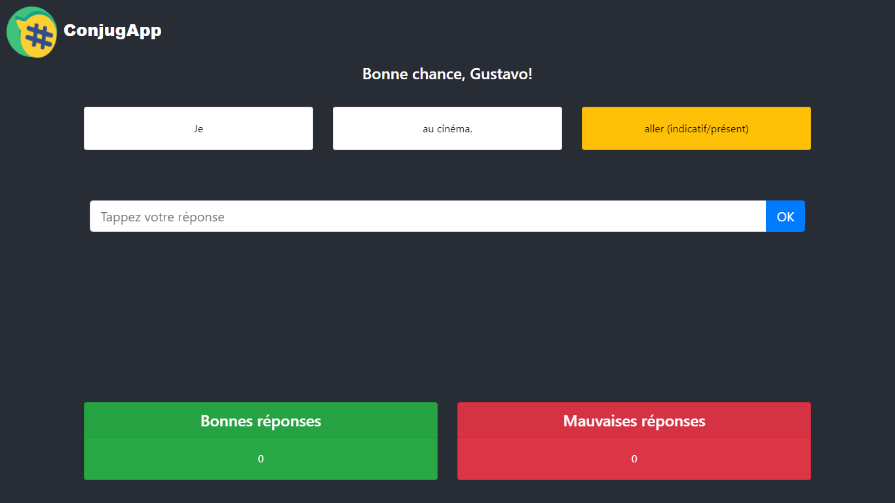
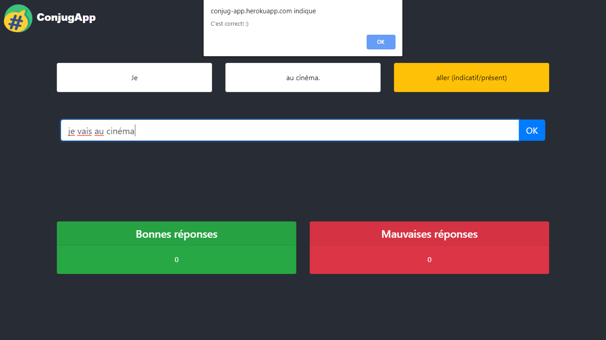
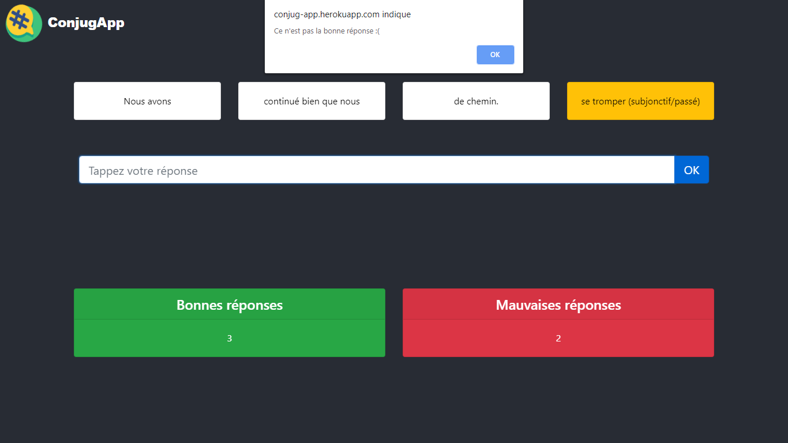

<h1 align="center">ConjugApp</h3>
<h3 align="center">A React web app to practice conjugation of french verbs</h4>
<h4 align="center"><a href="https://conjug-app.herokuapp.com/" target="_blank">Go to the live app</a></h4>

    
    
    
    

## Run/build the application

### `npm start` or `yarn start`

Runs the app in development mode. 
Open [http://localhost:3000](http://localhost:3000) to view it in the browser

### `npm run build` or `yarn build`

Builds the app for production to the `build` folder. 
It correctly bundles React in production mode and optimizes the build for the best performance.

The build is minified and the filenames include the hashes. 

## Related projects
<a href="https://github.com/hcgustavo/conjugapp-backend" target="_blank">ConjugApp Backend</a>
